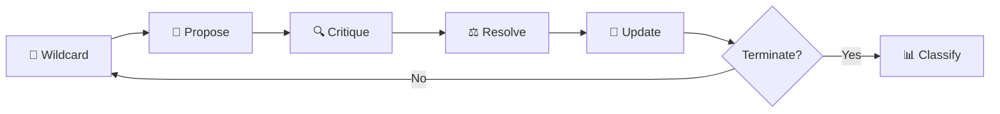
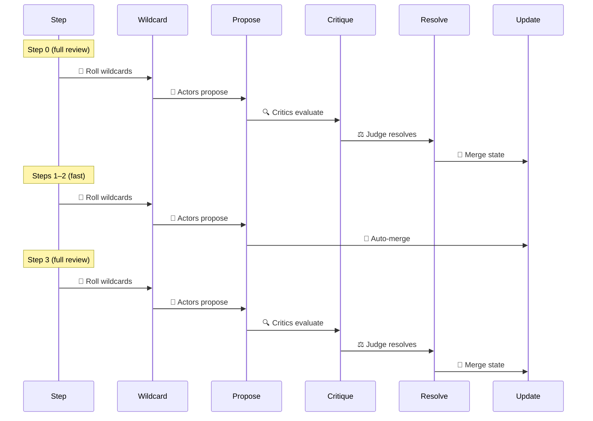
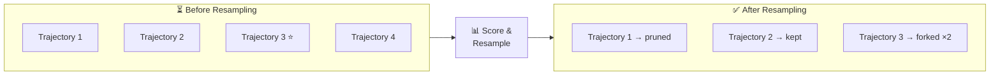
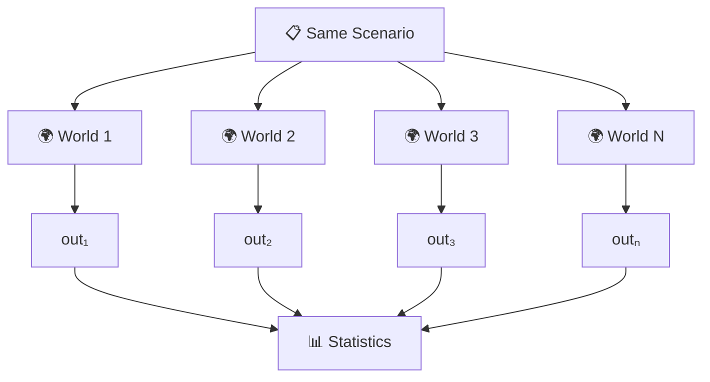
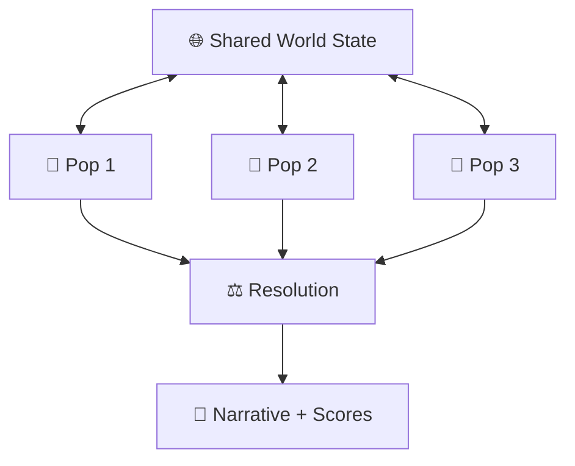
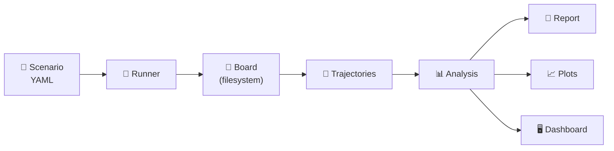

# minimal-agora

<p align="center">
  
</p>

A world simulation engine where LLM agents debate and interact to explore
counterfactual hypotheses and population dynamics.

## Why

History happened once. We can't rerun the Peloponnesian War or the Cold War
to see what would have changed. minimal-agora treats historical and
scientific questions as Monte Carlo problems: run the same scenario hundreds
of times with stochastic shocks and independent agent reasoning, then
aggregate outcomes into statistical answers.

The core idea is **structured disagreement**. Each simulation step forces
multiple agents — with different perspectives and domain expertise — to
propose, critique, and resolve what happens next. A judge synthesizes the
result. This adversarial loop produces more plausible trajectories than any
single prompt could, because bad proposals get filtered by critics before
they affect state.

Agents are stateless `claude -p` subprocesses. They share context through a
filesystem board (state, narrative, proposals). No fine-tuning, no memory,
no agent frameworks — just prompts, roles, and domain rules.

## Architecture

### Core Simulation Loop

Each step follows the same loop regardless of mode:



In population mode, the propose phase runs in order:
**forces → populations → critics → evaluator**.

### Review Interval Optimization

Skip critic/judge on routine steps for 2–3× speedup:



### Particle Filter (Sequential Importance Resampling)

Focus compute on the most interesting trajectories:



## Features

- **Three simulation modes** — `counterfactual` (N independent runs, statistical answers), `population` (interacting entities in a shared world), `open_ended` (single run optimizing fitness/complexity)
- **Pluggable providers** — `ClaudeSubprocessProvider` (default, uses `claude -p`), `AnthropicAPIProvider` (direct API access), `MockProvider` (deterministic testing)
- **Atomic checkpointing** — crash-safe writes via `tempfile` + `fsync` + `rename`
- **Statistical analysis** — z-test, bootstrap CIs, Cohen's d, cross-run comparison
- **Review interval** — skip critic/judge on routine steps for 2–3× speedup
- **Particle filtering** — sequential importance resampling to focus compute on interesting trajectories
- **Structured logging** — `structlog` with JSON/console rendering
- **Live dashboard** — WebSocket-based web dashboard for monitoring running simulations
- **Visualization** — matplotlib plots for state fields and population scores over time

## Simulation Modes

### `counterfactual`

Run the **same scenario N times independently** to answer statistical questions.

Each trajectory is an isolated run with the same agents and initial state but
different random seeds. Wildcards (asteroids, plagues) fire stochastically,
producing different paths. After all trajectories complete, outcomes are
classified and aggregated.

**Use for:** "How frequently does intelligence emerge?" "In what fraction of
runs does Rome fall before 200 AD?"



```bash
minimal-agora run scenarios/examples/intelligence.yaml -n 30 -m counterfactual
```

### `population`

Multiple **interacting entities** (civilizations, species, factions) share a
single world. Each entity has its own state subtree and agents. Forces (nature,
disease) modify the shared world. Critics check plausibility. Evaluators score
and resolve.

Run N times to get statistics across population scenarios ("How often does Rome
dominate?"). Each run is a full multi-entity simulation.

**Use for:** "What happens when Rome, Greece, and Persia compete for 1000
years?" "Which civilization dominates under different starting conditions?"



Entity types:

| Type | Role | Owns state | Modifies | Sees |
|------|------|-----------|----------|------|
| `population` | Civilization, species, faction | own subtree | own state + interactions | shared world + own state |
| `force` | Nature, disease, economics | nothing | shared world state | shared world |
| `critic` | Plausibility checker | nothing | nothing (read-only) | everything |
| `evaluator` | Judge, historian, scorer | nothing | scores/rewards | everything post-resolution |

```bash
minimal-agora run scenarios/examples/mediterranean.yaml -n 10 -m population
```

### `open_ended`

Single long-running simulation optimizing for a goal (complexity,
interestingness). Uses a fitness function to measure progress. Can use either
flat agents or entities.

**Use for:** "Evolve the most complex ecosystem possible." "Generate the most
interesting geopolitical timeline."

## Scenario Configuration

Scenarios are YAML files that define everything domain-specific:

```yaml
name: "my-scenario"
mode: counterfactual          # or population, open_ended
n_trajectories: 10
step_budget: 20

initial_state:                # starting world state (JSON-like)
  planet:
    climate: temperate

agents:                       # flat agent list (counterfactual/open_ended)
  - role: actor
    name: natural_selection
    perspective: "You represent..."

entities:                     # typed entities (population mode)
  - name: rome
    type: population
    state_prefix: "populations.rome"
    initial_state:
      military_strength: 60
    agents:
      - role: actor
        name: roman_senate
        perspective: "You represent..."
    can_interact_with: ["greece"]

rules:                        # domain-specific governing rules
  - name: natural_selection
    description: "Evolution operates through variation and selection..."
    applies_to: ["actor"]     # optional: restrict to specific roles/agents

wildcards_enabled: true        # off by default; opt in per scenario

wildcards:                    # stochastic external shocks
  - name: asteroid_impact
    probability: 1.0           # expected occurrences per trajectory
    description: "A major asteroid impact..."
    state_impact:
      environment:
        biodiversity: "collapse"

termination:
  max_steps: 500
  conditions:
    - field: "life.intelligence"
      equals: true

outcome:
  question: "Did intelligent life emerge?"
  classifier:
    - name: intelligent_life
      condition:
        field: "life.intelligence"
        equals: true
    - name: stagnation
      default: true
```

## CLI

```bash
# Run a scenario
minimal-agora run scenario.yaml [options]
  -n, --n-trajectories N    Override number of trajectories
  -m, --mode MODE           Override mode (counterfactual/population/open_ended)
  -c, --concurrency N       Max parallel trajectories (default: 2)
  --steps N                 Override step budget
  --timeout N               Agent timeout in seconds (default: 300)
  --dry-run                 Validate and summarize scenario without running
  -o, --output DIR          Output directory (default: runs/)

# Generate report from completed run
minimal-agora report runs/my-scenario/ [--format text|json]

# Generate plots from completed run
minimal-agora visualize runs/my-scenario/ [--fields field1 field2] [--populations pop1] [--scores score1]

# Launch live web dashboard
minimal-agora dashboard runs/my-scenario/ [-p PORT] [--fields field1] [--populations pop1] [--scores score1]

# Validate a scenario file
minimal-agora validate scenario.yaml

# Generate a template scenario
minimal-agora init-scenario my-scenario [--mode counterfactual|population|open_ended] [--force]

# List agents/entities from a scenario
minimal-agora agents scenario.yaml

# Compare outcomes from two runs
minimal-agora compare runs/run-a/ runs/run-b/ [--alpha 0.05] [--format text|json]

# Show version info
minimal-agora version

# Examples
minimal-agora run scenarios/examples/intelligence.yaml -n 5
minimal-agora run scenarios/examples/mediterranean.yaml -n 3 -m population
minimal-agora run scenarios/examples/intelligence.yaml -n 30 --steps 10  # quick test run
```

## Example Scenarios

| Scenario | Mode | Steps | Step scale | Time span | Question |
|----------|------|-------|------------|-----------|----------|
| intelligence | counterfactual | 500 | 10M years | 5B years | Does intelligence emerge? |
| mediterranean | population | 500 | 2 years | 1000 years | Which civilization dominates? |
| pandemic | counterfactual | 200 | 1 week | ~4 years | Does coordinated response prevent collapse? |
| market | population | 300 | 1 month | 25 years | Which competitive dynamic prevails? |
| complexity | open_ended | 500 | 10M years | 5B years | What complexity level is achieved? |
| democracy | counterfactual | 1000 | 5 years | 5000 years | Does liberal democracy emerge? |
| capitalism | counterfactual | 800 | 5 years | 4000 years | Does market capitalism emerge? |
| nuclear_war | counterfactual | 500 | 1 month | ~42 years | Does nuclear war occur? |

Use `--steps 10` for quick test runs.

## Features

- **Provider abstraction** — `AgentProvider` protocol decouples the engine from
  any specific LLM backend. Ships with `ClaudeSubprocessProvider` (production)
  and `MockProvider` (testing). Swap providers without changing simulation code.

- **Atomic checkpointing** — crash-safe state writes using temp-file-then-rename.
  If the process dies mid-step, the last committed checkpoint is intact.

- **Statistical analysis** — z-test for outcome proportions, bootstrap confidence
  intervals, Cohen's d effect size, and cross-run comparison (`minimal-agora compare`).

- **Review interval** — skip critic/judge evaluation on non-review steps to reduce
  LLM calls. Configure `review_interval` in the scenario to run critique every
  N steps instead of every step.

- **Particle filtering** — sequential importance resampling across trajectories.
  Score trajectories every K steps, prune low-weight runs, and fork high-weight
  ones to focus compute on the most interesting branches.

## Data Flow



## Requirements

- Python 3.12+
- `claude` CLI (Claude Code) installed and authenticated
- `uv` for dependency management

```bash
uv sync
uv run minimal-agora run scenarios/examples/intelligence.yaml -n 3
uv run minimal-agora run scenarios/examples/intelligence.yaml -n 3 --steps 10  # quick test
```
