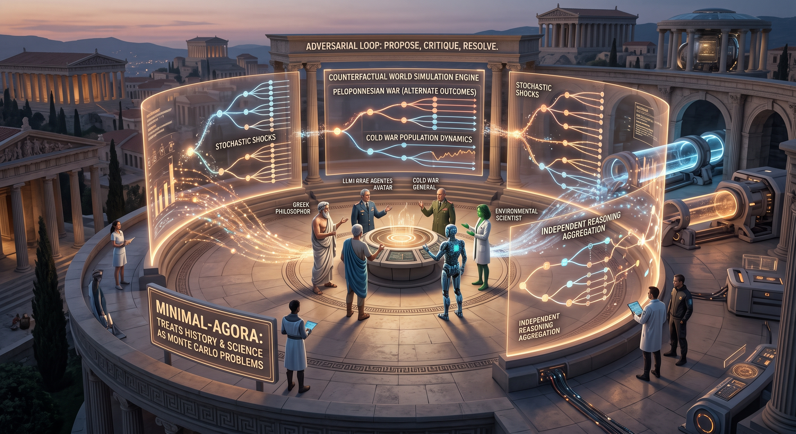
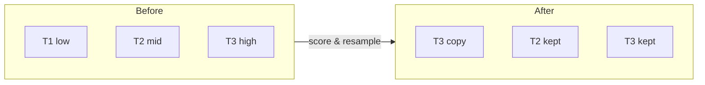
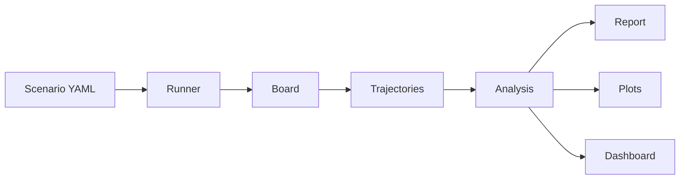
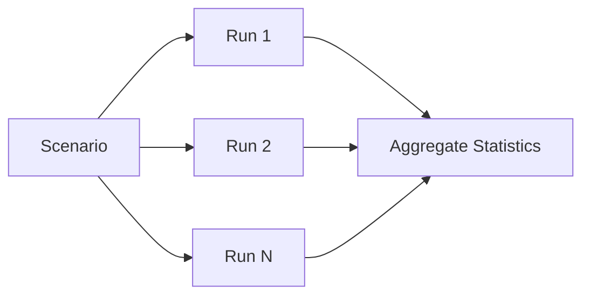
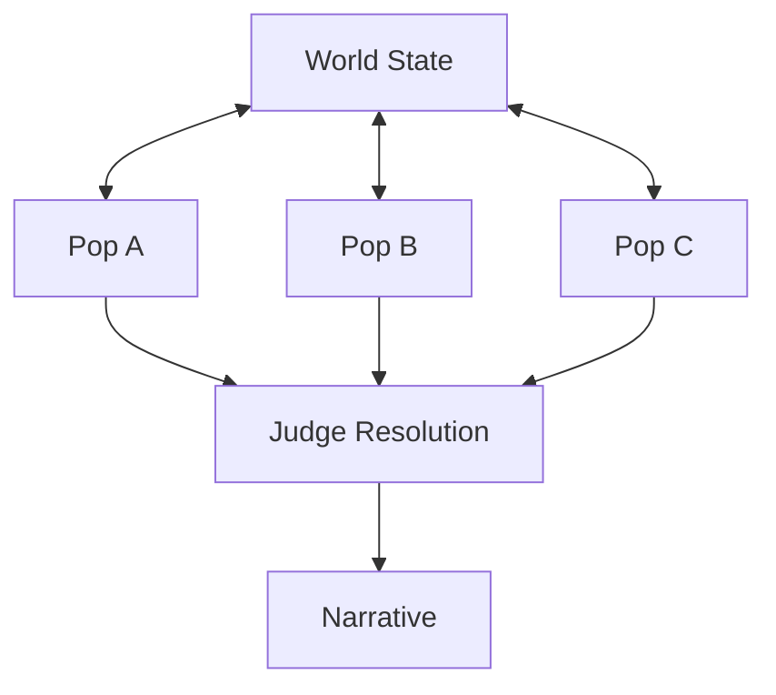

# minimal-agora

<p align="center">
  
</p>

A world simulation engine where LLM agents debate and interact to explore
counterfactual hypotheses and population dynamics.

## Why

History happened once. We can't rerun the Peloponnesian War or the Cold War
to see what would have changed. minimal-agora treats historical and
scientific questions as Monte Carlo problems: run the same scenario hundreds
of times with stochastic shocks and independent agent reasoning, then
aggregate outcomes into statistical answers.

The core idea is **structured disagreement**. Each simulation step forces
multiple agents — with different perspectives and domain expertise — to
propose, critique, and resolve what happens next. A judge synthesizes the
result. This adversarial loop produces more plausible trajectories than any
single prompt could, because bad proposals get filtered by critics before
they affect state.

Agents are stateless `claude -p` subprocesses. They share context through a
filesystem board (state, narrative, proposals). No fine-tuning, no memory,
no agent frameworks — just prompts, roles, and domain rules.

## Installation

```bash
# Clone the repository
git clone https://github.com/georgosgeorgos/minimal-agora.git
cd minimal-agora

# Install dependencies
uv sync --group dev

# Verify everything works
uv run pytest tests/ -v
```

**Requirements:** Python 3.12+, [uv](https://docs.astral.sh/uv/), [Claude Code CLI](https://docs.anthropic.com/en/docs/claude-code) (installed and authenticated)

## Quick Start

```bash
# Run a short simulation (3 trajectories, 10 steps)
uv run minimal-agora run scenarios/examples/intelligence.yaml -n 3 --steps 10

# View results
uv run minimal-agora report runs/intelligence/

# Launch the dashboard
uv run minimal-agora dashboard
```

See [docs/guide.md](docs/guide.md) for the full design guide with detailed architecture and configuration reference.

## Architecture

### Core Simulation Loop

Each step follows the same loop regardless of mode:


In population mode, the propose phase runs in order:
**forces → populations → critics → evaluator**.

### Review Interval Optimization

Skip critic/judge on routine steps for 2-3x speedup:

| Step | Wildcard | Propose | Critique | Resolve | Update |
|------|----------|---------|----------|---------|--------|
| 0    | yes      | yes     | **yes**  | **yes** | yes    |
| 1    | yes      | yes     | skip     | skip    | auto   |
| 2    | yes      | yes     | skip     | skip    | auto   |
| 3    | yes      | yes     | **yes**  | **yes** | yes    |

### Particle Filter (Sequential Importance Resampling)

Focus compute on the most interesting trajectories:



### Data Flow



## Simulation Modes

### `counterfactual`

Run the **same scenario N times independently** to answer statistical questions.
Wildcards fire stochastically, producing different paths. Outcomes are classified
and aggregated.



**Use for:** "How frequently does intelligence emerge?" "In what fraction of
runs does Rome fall before 200 AD?"

```bash
minimal-agora run scenarios/examples/intelligence.yaml -n 30 -m counterfactual
```

### `population`

Multiple **interacting entities** (civilizations, species, factions) share a
single world. Each entity has its own state subtree and agents. Forces modify
the shared world. Critics check plausibility. Evaluators score and resolve.



Entity types:

| Type | Role | Owns state | Modifies | Sees |
|------|------|-----------|----------|------|
| `population` | Civilization, species, faction | own subtree | own state + interactions | shared world + own state |
| `force` | Nature, disease, economics | nothing | shared world state | shared world |
| `critic` | Plausibility checker | nothing | nothing (read-only) | everything |
| `evaluator` | Judge, historian, scorer | nothing | scores/rewards | everything post-resolution |

```bash
minimal-agora run scenarios/examples/mediterranean.yaml -n 10 -m population
```

### `open_ended`

Single long-running simulation optimizing for a goal (complexity,
interestingness). Uses a fitness function to measure progress. Can use either
flat agents or entities.

**Use for:** "Evolve the most complex ecosystem possible." "Generate the most
interesting geopolitical timeline."

## Scenario Configuration

Scenarios are YAML files that define everything domain-specific:

```yaml
name: "my-scenario"
mode: counterfactual          # or population, open_ended
n_trajectories: 10
step_budget: 20

initial_state:                # starting world state (JSON-like)
  planet:
    climate: temperate

agents:                       # flat agent list (counterfactual/open_ended)
  - role: actor
    name: natural_selection
    perspective: "You represent..."

entities:                     # typed entities (population mode)
  - name: rome
    type: population
    state_prefix: "populations.rome"
    initial_state:
      military_strength: 60
    agents:
      - role: actor
        name: roman_senate
        perspective: "You represent..."
    can_interact_with: ["greece"]

rules:                        # domain-specific governing rules
  - name: natural_selection
    description: "Evolution operates through variation and selection..."
    applies_to: ["actor"]     # optional: restrict to specific roles/agents

wildcards_enabled: true        # off by default; opt in per scenario

wildcards:                    # stochastic external shocks
  - name: asteroid_impact
    probability: 1.0           # expected occurrences per trajectory
    description: "A major asteroid impact..."
    state_impact:
      environment:
        biodiversity: "collapse"

termination:
  max_steps: 500
  conditions:
    - field: "life.intelligence"
      equals: true

outcome:
  question: "Did intelligent life emerge?"
  classifier:
    - name: intelligent_life
      condition:
        field: "life.intelligence"
        equals: true
    - name: stagnation
      default: true
```

## CLI

```bash
# Run a scenario
minimal-agora run scenario.yaml [options]
  -n, --n-trajectories N    Override number of trajectories
  -m, --mode MODE           Override mode (counterfactual/population/open_ended)
  -c, --concurrency N       Max parallel trajectories (default: 2)
  --steps N                 Override step budget
  --timeout N               Agent timeout in seconds (default: 300)
  --dry-run                 Validate and summarize scenario without running
  -o, --output DIR          Output directory (default: runs/)

# Generate report from completed run
minimal-agora report runs/my-scenario/ [--format text|json]

# Generate plots from completed run
minimal-agora visualize runs/my-scenario/ [--fields field1 field2] [--populations pop1] [--scores score1]

# Launch live web dashboard
minimal-agora dashboard runs/my-scenario/ [-p PORT] [--fields field1] [--populations pop1] [--scores score1]

# Validate a scenario file
minimal-agora validate scenario.yaml

# Generate a template scenario
minimal-agora init-scenario my-scenario [--mode counterfactual|population|open_ended] [--force]

# List agents/entities from a scenario
minimal-agora agents scenario.yaml

# Compare outcomes from two runs
minimal-agora compare runs/run-a/ runs/run-b/ [--alpha 0.05] [--format text|json]

# Show version info
minimal-agora version
```

## Example Scenarios

| Scenario | Mode | Steps | Step scale | Time span | Question |
|----------|------|-------|------------|-----------|----------|
| intelligence | counterfactual | 500 | 10M years | 5B years | Does intelligence emerge? |
| mediterranean | population | 500 | 2 years | 1000 years | Which civilization dominates? |
| pandemic | counterfactual | 200 | 1 week | ~4 years | Does coordinated response prevent collapse? |
| market | population | 300 | 1 month | 25 years | Which competitive dynamic prevails? |
| complexity | open_ended | 500 | 10M years | 5B years | What complexity level is achieved? |
| democracy | counterfactual | 1000 | 5 years | 5000 years | Does liberal democracy emerge? |
| capitalism | counterfactual | 800 | 5 years | 4000 years | Does market capitalism emerge? |
| nuclear_war | counterfactual | 500 | 1 month | ~42 years | Does nuclear war occur? |

Use `--steps 10` for quick test runs.

## Features

- **Three simulation modes** — `counterfactual` (N independent runs, statistical answers), `population` (interacting entities in a shared world), `open_ended` (single run optimizing fitness/complexity)
- **Pluggable providers** — `ClaudeSubprocessProvider` (default, uses `claude -p`), `AnthropicAPIProvider` (direct API access), `MockProvider` (deterministic testing)
- **Atomic checkpointing** — crash-safe writes via `tempfile` + `fsync` + `rename`
- **Statistical analysis** — z-test, bootstrap CIs, Cohen's d, cross-run comparison
- **Review interval** — skip critic/judge on routine steps for 2-3x speedup
- **Particle filtering** — sequential importance resampling: duplicate high-weight trajectories, replace low-weight ones to focus compute on interesting branches
- **Structured logging** — `structlog` with JSON/console rendering
- **Live dashboard** — WebSocket-based web dashboard for monitoring running simulations
- **Visualization** — matplotlib plots for state fields and population scores over time

## Documentation

- [Design Guide](docs/guide.md) — full architecture, configuration reference, and flow diagrams
- [Simulation Structure](docs/simulation-structure.md) — detailed simulation internals
- [Example Scenarios](scenarios/examples/) — ready-to-run YAML scenarios
