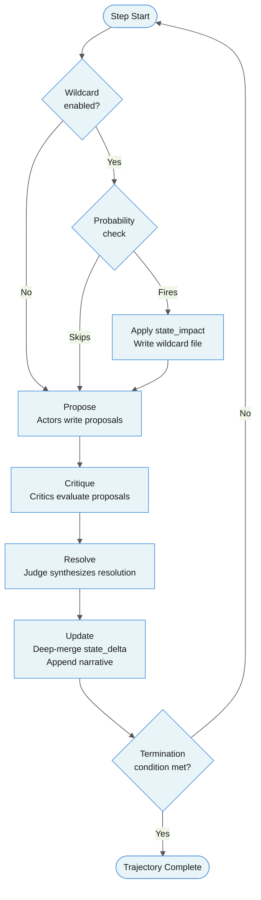
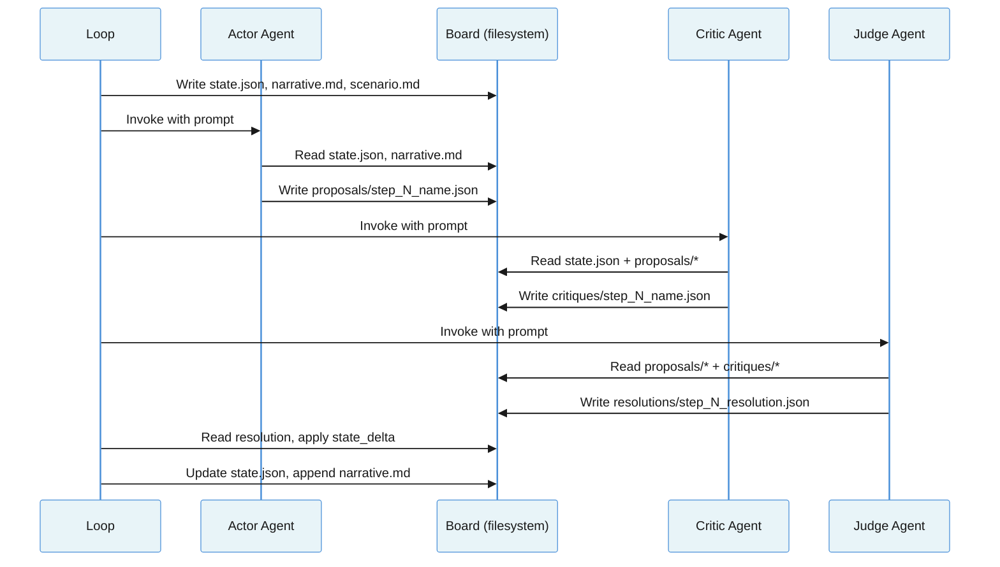
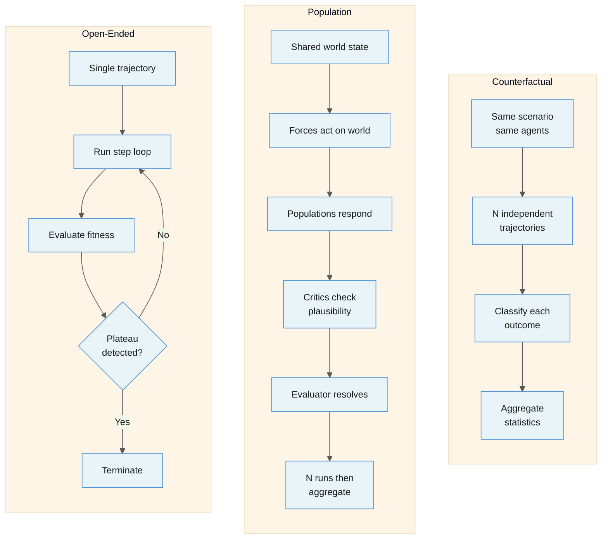
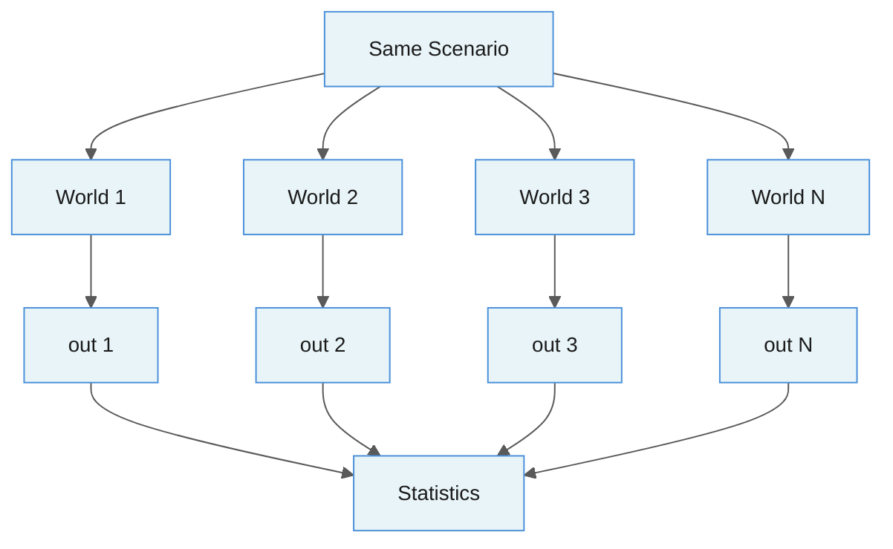
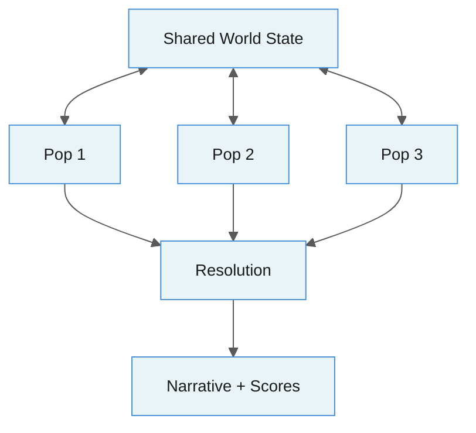
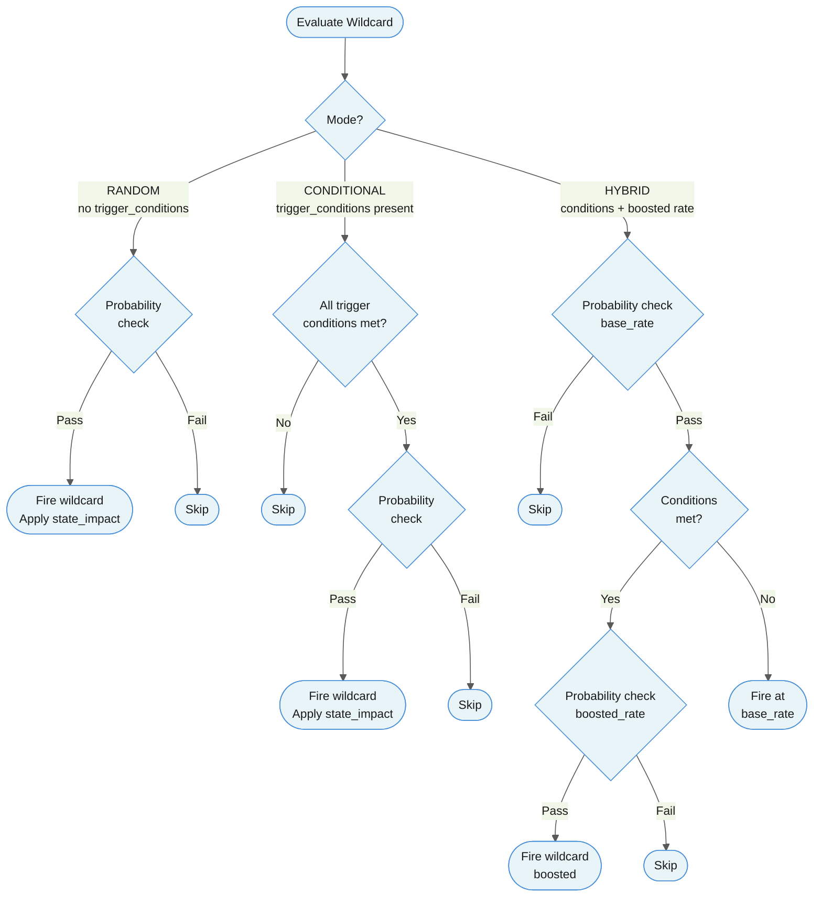
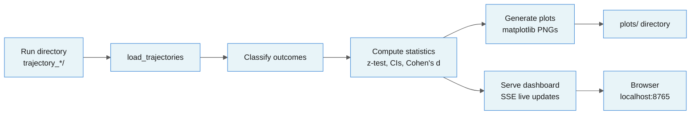
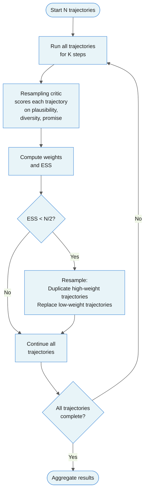

# minimal-agora Design & Usage Guide

## 1. Overview

minimal-agora is a world simulation engine where LLM agents debate and interact
to explore counterfactual hypotheses and population dynamics.

History happened once. We cannot rerun the Peloponnesian War or the Cold War to
see what would have changed. minimal-agora treats historical and scientific
questions as **Monte Carlo problems**: run the same scenario hundreds of times
with stochastic shocks and independent agent reasoning, then aggregate outcomes
into statistical answers.

### Core Design Philosophy

**Structured disagreement.** Each simulation step forces multiple agents — with
different perspectives and domain expertise — to propose, critique, and resolve
what happens next. A judge synthesizes the result. This adversarial loop produces
more plausible trajectories than any single prompt could, because bad proposals
get filtered by critics before they affect state.

**Stateless agents.** Agents are `claude -p` subprocesses with no memory, no
fine-tuning, no agent frameworks. They share context exclusively through a
filesystem board — a directory of JSON and Markdown files containing state,
narrative, and proposals. Each agent reads the board, does its work, and writes
back.

**Monte Carlo trajectories.** Running the same scenario N times with different
random seeds produces a distribution of outcomes. Wildcards (asteroids, plagues,
economic shocks) fire stochastically, producing divergent paths. After all
trajectories complete, outcomes are classified and aggregated into statistical
summaries with confidence intervals.

**Particle filtering.** For trajectory-level exploration, the runner supports
sequential importance resampling. Trajectories are periodically scored, and
low-weight (boring/implausible) runs are replaced with duplicates of
high-weight (interesting/promising) ones — concentrating compute on the most
informative branches of the simulation while preserving the total trajectory count.

---

## 2. Architecture

### The Core Loop

Every simulation step, regardless of mode, follows the same six-phase
adversarial loop:

```
WILDCARD → PROPOSE → CRITIQUE → RESOLVE → UPDATE → CHECK
```

| Phase | What happens |
|-------|-------------|
| **WILDCARD** | Roll for stochastic external shocks (asteroid, plague, war). If triggered, the event is written to the board and its `state_impact` is applied. |
| **PROPOSE** | Actor agents read the board (state, narrative, scenario description, active wildcard) and write proposals — JSON files containing `proposed_changes`, `reasoning`, and `confidence`. |
| **CRITIQUE** | Critic agents read the board and all proposals, then evaluate each for plausibility, consistency, and realism. They write critiques with `plausibility` scores and lists of `issues`. |
| **RESOLVE** | A judge agent reads proposals and critiques, synthesizes them into a single `Resolution` containing a `state_delta` (changes to apply), a `narrative` (historical account), and `reasoning`. |
| **UPDATE** | The resolution's `state_delta` is deep-merged into the current state. The narrative is appended to the narrative log. A state snapshot is saved to the history directory. |
| **CHECK** | Termination conditions are evaluated. If any condition matches (a field equals/exceeds a threshold), the trajectory ends. For open-ended mode, a fitness plateau check also runs. |

The following diagram shows the core simulation loop with its decision points for wildcard firing and termination:



If no judge agent is configured, or if the judge fails to produce output, a
**fallback resolution** merges all proposals' `proposed_changes` and concatenates
their reasoning.

### The Board

The Board is the filesystem-backed communication substrate between agents.
Agents are fully stateless — they have no memory of prior steps and no
communication channel except files on disk.

Each trajectory gets its own workspace directory with this structure:

```
trajectory_000/
├── board/
│   ├── state.json              # Current world state (the "truth")
│   ├── narrative.md            # Cumulative narrative log
│   ├── scenario.md             # Scenario description, agents, rules
│   └── wildcard_step_003.json  # Active wildcard for step 3 (if any)
├── proposals/
│   ├── step_003_natural_selection.json
│   └── step_003_geological_forces.json
├── critiques/
│   └── step_003_plausibility_critic.json
├── resolutions/
│   └── step_003_resolution.json
├── history/
│   ├── step_000_state.json     # Initial state snapshot
│   ├── step_001_state.json     # State after step 1
│   ├── step_001_full.json      # Complete Step record (proposals, critiques, resolution)
│   └── ...
└── trajectory.json             # Final trajectory with outcome (written on completion)
```

The Board class (`board.py`) provides methods for reading/writing state,
saving proposals/critiques/resolutions, snapshotting history, and managing
wildcards. State writes use `json.dump` — the atomic guarantee comes from
writing complete files, not partial updates.

Key Board operations:

| Method | Purpose |
|--------|---------|
| `read_state()` | Read `board/state.json` into a dict |
| `write_state(state)` | Write a dict to `board/state.json` |
| `apply_resolution(resolution, step)` | Deep-merge `state_delta` into state, snapshot, append narrative |
| `save_proposal(proposal, step)` | Write proposal JSON to `proposals/` |
| `save_critique(critique, step)` | Write critique JSON to `critiques/` |
| `save_resolution(resolution, step)` | Write resolution JSON to `resolutions/` |
| `save_step(step)` | Write complete step record to `history/` |
| `write_wildcard(event, step)` | Write wildcard event JSON to `board/` |
| `clear_wildcard(step)` | Remove wildcard file for a step |

### Agent Interaction Flow

The following sequence diagram shows how agents interact through the filesystem board during a single step:



### Deep Merge

State updates use deep merge (`_deep_merge`): when the resolution's
`state_delta` contains nested dicts, they are recursively merged into the
existing state rather than replacing entire subtrees. Scalar values are
overwritten.

```python
# state = {"planet": {"climate": "temperate", "oceans": true}}
# delta = {"planet": {"climate": "frozen"}}
# result = {"planet": {"climate": "frozen", "oceans": true}}
```

### Crash Recovery

The loop supports resume-from-checkpoint. On startup, `_detect_resume_point`
scans the `history/` directory for completed step files. If a trajectory was
interrupted mid-run, it resumes from the last completed step rather than
restarting from scratch. Completed trajectories (those with a written
`trajectory.json` containing an outcome) are skipped entirely.

---

## 3. Simulation Modes

minimal-agora supports three simulation modes, each suited to different kinds of
questions.

The following diagram compares the three modes side by side:



### Counterfactual Mode

```
mode: counterfactual
```

Run the **same scenario N times independently** to answer statistical questions.
Each trajectory is an isolated run with the same agents, rules, and initial state
but different random seeds. Wildcards fire stochastically, producing divergent
paths. After all trajectories complete, outcomes are classified and aggregated.



**Use for:** "How frequently does intelligence emerge?" "In what fraction of
runs does Rome fall before 200 AD?" "Does coordinated pandemic response prevent
societal collapse?"

```bash
minimal-agora run scenarios/examples/intelligence.yaml -n 30 -m counterfactual
```

### Population Mode

```
mode: population
```

Multiple **interacting entities** (civilizations, species, factions) share a
single world state. Each entity has its own state subtree and agents. Forces
(nature, disease) modify the shared world. Critics check plausibility.
Evaluators score and resolve.

In population mode, the propose phase runs in a fixed order:

```
forces → populations → critics → evaluator
```

This ordering matters: forces act on the world first (earthquakes, plagues),
then populations respond, then critics check plausibility, and finally the
evaluator-judge resolves everything.

Run N times to get statistics across population scenarios.



**Use for:** "What happens when Rome, Greece, and Persia compete for 1000
years?" "Which civilization dominates under different starting conditions?"

```bash
minimal-agora run scenarios/examples/mediterranean.yaml -n 10 -m population
```

#### Entity Types

Entities in population mode have one of four types:

| Type | Role | Owns state subtree | Can modify | Sees |
|------|------|-------------------|------------|------|
| `population` | Civilization, species, faction | Yes (`state_prefix`) | Own state + interactions | Shared world + own state + neighbors |
| `force` | Nature, disease, economics | No | Shared world state | Shared world |
| `critic` | Plausibility checker | No | Nothing (read-only) | Everything |
| `evaluator` | Judge, historian, scorer | No | Scores/rewards | Everything post-resolution |

**Population entities** are the primary actors. Each has a `state_prefix`
(e.g., `populations.rome`) that determines where its state lives in the global
state tree. Populations can declare `can_interact_with` — a list of other
entity names whose state they can observe. The `build_interaction_context`
function constructs a "Neighboring Entities" prompt section showing each
neighbor's current state.

**Force entities** represent world-level dynamics that are indifferent to
any specific population — natural disasters, demographic shifts, economic
cycles. Their agents propose changes to the shared world state.

**Critic entities** evaluate all proposals for plausibility without modifying
anything.

**Evaluator entities** contain a judge agent that synthesizes all proposals
and critiques into the final resolution.

#### Interaction Modes

Population entities can configure how they interact with neighbors:

| Mode | Behavior |
|------|----------|
| `always` | Entity sees neighbor state every step |
| `conditional` | Interaction depends on conditions (not yet implemented beyond the mode flag) |
| `scheduled` | Entity sees neighbors every N steps (`every_n_steps`) |
| `never` | Entity never sees neighbor state |

### Open-Ended Mode

```
mode: open_ended
```

Single long-running simulation optimizing for a goal (complexity,
interestingness). Uses a **fitness function** to measure progress. Terminates
either at `max_steps`, when a termination condition is met, or when fitness
**plateaus** (no improvement within a window).

The fitness function is configured via the `fitness` field:

```yaml
fitness:
  metric: "life.complexity"     # dot-path into state
  direction: maximize           # or minimize
```

Plateau detection compares the range of recent fitness values within a sliding
window. If `max(recent) - min(recent) < plateau_threshold`, the trajectory
is considered plateaued and terminates early.

```yaml
termination:
  plateau_window: 5       # number of steps to consider
  plateau_threshold: 0.5  # minimum range to be considered "still improving"
```

**Use for:** "Evolve the most complex ecosystem possible." "Generate the most
interesting geopolitical timeline."

---

## 4. Scenario Configuration

Scenarios are YAML (or JSON) files that define everything domain-specific about a
simulation. The `Scenario` Pydantic model validates the configuration strictly —
unknown fields cause validation errors.

### Full Schema Reference

```yaml
# Required fields
name: "my-scenario"                    # Unique scenario name
mode: counterfactual                   # counterfactual | population | open_ended
initial_state:                         # Starting world state (arbitrary nested dict)
  planet:
    climate: temperate

# Optional fields with defaults
n_trajectories: 1                      # Number of independent runs (default: 1)
step_budget: 50                        # Max steps per trajectory (default: 50)
description: ""                        # Human-readable description

# Agents (flat mode — counterfactual/open_ended)
agents:
  - role: actor                        # actor | critic | judge
    name: agent_name                   # Unique agent name
    perspective: "Your role is..."     # Agent's system prompt
    model: null                        # Optional model override

# Entities (population mode)
entities:
  - name: rome
    type: population                   # population | force | critic | evaluator
    state_prefix: "populations.rome"   # Dot-path into state for this entity's subtree
    initial_state:                     # Merged into global state at state_prefix
      military_strength: 60
    agents:                            # This entity's agents
      - role: actor
        name: roman_senate
        perspective: "..."
    can_interact_with: ["greece"]       # Names of entities this one can observe
    interaction:
      mode: always                     # always | conditional | scheduled | never
      every_n_steps: 1                 # For scheduled mode

# Rules
rules:
  - name: rule_name
    description: "What this rule governs..."
    applies_to: []                     # Optional: restrict to specific agent names/roles

# Wildcards
wildcards_enabled: false               # Must be true for wildcards to fire
wildcards:
  - name: event_name
    probability: 0.1                   # Expected occurrences per trajectory
    description: "What happens..."
    state_impact:                      # Changes applied when wildcard fires
      field.path: value
    trigger_conditions:                # Optional: conditional wildcards
      - field: "path.to.field"
        operator: gte                  # gt | lt | eq | gte | lte
        threshold: 50.0

# Termination
termination:
  max_steps: 500                       # Hard cap on steps
  conditions:                          # Any condition match → terminate
    - field: "path.to.field"
      equals: true                     # Exact match
    - field: "path.to.field"
      greater_than: 80                 # Numeric comparison
    - field: "path.to.field"
      less_than: 5                     # Numeric comparison
  # Open-ended mode only:
  plateau_window: 5                    # Steps to check for plateau
  plateau_threshold: 0.01             # Range below which fitness is "flat"

# Outcome classification
outcome:
  question: "The question this scenario answers"
  classifier:
    - name: outcome_name
      condition:
        field: "path.to.field"
        equals: true                   # or greater_than / less_than
    - name: default_outcome
      default: true                    # Fallback if no condition matches

# Fitness (open_ended mode)
fitness:
  metric: "path.to.field"             # State field to track
  direction: maximize                  # maximize | minimize

# Narrative compression
narrative_window: null                 # Keep only this many recent steps in narrative
                                       # Older steps are summarized into a preamble
```

### Annotated Example: Counterfactual

```yaml
name: "emergence-of-intelligence"
mode: counterfactual
n_trajectories: 5
step_budget: 500
description: >
  Simulate the evolution of life on an Earth-like planet over billions of years.
  Each step represents roughly 10 million years.

initial_state:
  planet:
    type: terrestrial
    climate: temperate
    oceans: true
    atmosphere: reducing
  life:
    exists: true
    complexity: unicellular
    intelligence: false
  environment:
    oxygen_level: trace
    biodiversity: low
  time:
    step: 0
    step_scale: "10 million years"

# Rules ground agent reasoning in domain knowledge
rules:
  - name: natural_selection
    description: >
      Evolution operates through variation, selection, and inheritance.
      No teleology — evolution does not "aim" at complexity.
  - name: complexity_ratchet
    description: >
      Once a level of complexity is achieved, it is rarely lost entirely
      unless a catastrophic event occurs.

# Flat agent list: actors propose, critics check, judge resolves
agents:
  - role: actor
    name: natural_selection
    perspective: >
      You represent the force of natural selection and evolution...
  - role: actor
    name: geological_forces
    perspective: >
      You represent geological, atmospheric, and cosmic forces...
  - role: critic
    name: plausibility_critic
    perspective: >
      You are a scientific plausibility checker...
  - role: judge
    name: arbiter
    perspective: >
      You synthesize evolutionary and geological proposals...

wildcards_enabled: true
wildcards:
  - name: asteroid_impact
    probability: 1.0      # Expected ~1 occurrence per 500-step trajectory
    description: >
      A major asteroid impact event. Causes mass extinction.
    state_impact:
      environment:
        mass_extinctions: "+1"
        biodiversity: "collapse"

termination:
  max_steps: 500
  conditions:
    - field: "life.intelligence"
      equals: true
    - field: "life.exists"
      equals: false

outcome:
  question: "Did intelligent life emerge?"
  classifier:
    - name: intelligent_life
      condition:
        field: "life.intelligence"
        equals: true
    - name: extinction
      condition:
        field: "life.exists"
        equals: false
    - name: stagnation
      default: true
```

### Annotated Example: Population

```yaml
name: "mediterranean-powers"
mode: population
n_trajectories: 5
step_budget: 500
description: >
  Simulate Mediterranean civilizations over 1000 years. Each step is ~2 years.

initial_state:
  world:
    era: "classical_antiquity"
    trade_routes: ["aegean", "adriatic"]
  geography:
    mediterranean_control: "contested"
    climate: temperate
  time:
    step: 0
    step_scale: "2 years"
    year: -500

# Each entity type plays a different role in the simulation
entities:
  # Population entities own state subtrees and propose changes
  - name: rome
    type: population
    state_prefix: "populations.rome"
    initial_state:
      military_strength: 60
      economy: 50
      culture: 40
    agents:
      - role: actor
        name: roman_senate
        perspective: "You represent Roman strategic decision-making..."
    can_interact_with: ["greece", "persia"]
    interaction:
      mode: always

  # Force entities modify the shared world state
  - name: nature
    type: force
    agents:
      - role: actor
        name: environmental_forces
        perspective: "You represent natural forces..."

  # Critic entities evaluate plausibility
  - name: historian
    type: critic
    agents:
      - role: critic
        name: historical_critic
        perspective: "You evaluate historical plausibility..."

  # Evaluator entities contain the judge
  - name: thucydides
    type: evaluator
    agents:
      - role: judge
        name: thucydides_judge
        perspective: "You synthesize proposals into the most plausible outcome..."

rules:
  - name: resource_competition
    description: "Populations compete for finite resources..."
  - name: military_logistics
    description: "Campaigns require supply lines and manpower..."
    applies_to: ["population", "critic"]  # Only shown to these roles
```

### Rules

Rules are domain-specific constraints injected into agent prompts. Each rule has
a `name`, `description`, and optional `applies_to` list. If `applies_to` is
empty, the rule is shown to all agents. If populated, the rule is only included
in prompts for agents whose name or role appears in the list.

Rules appear in agent prompts under a "Governing Rules" header with a preamble:
"These rules define the dynamics of this simulation. All proposals, critiques,
and resolutions MUST respect these rules."

### Narrative Compression

Long-running simulations accumulate large narrative logs. The `narrative_window`
setting (integer or null) controls compression. When set, only the most recent
N steps are kept in full in the narrative. Older steps are summarized into a
"Summary of Earlier Steps" preamble using first-sentence extraction.

Summaries are built in batches of 10 steps. Existing summaries are preserved
and appended to, so compression is incremental — the summary grows while the
detail window slides forward.

```yaml
narrative_window: 20    # Keep 20 recent steps in full, summarize older ones
```

### Diversity Lenses

To prevent trajectory collapse (all N runs producing the same outcome),
minimal-agora assigns a **diversity lens** to each trajectory based on its ID.
Ten predefined lenses rotate through trajectories:

- Focus on the most probable outcome
- Explore unlikely but plausible outcomes
- Emphasize long-term consequences
- Consider second-order effects
- Prioritize stability and equilibrium
- Focus on competition and conflict
- Emphasize cooperation and mutual benefit
- Consider environmental and resource constraints
- Explore the role of random variation
- Focus on internal dynamics

The lens is prepended to actor prompts as an exploration directive, encouraging
divergent reasoning across parallel runs.

---

## 5. Wildcards

Wildcards are stochastic external shocks that inject unpredictability into
simulations. They must be explicitly enabled per scenario.

```yaml
wildcards_enabled: true    # Off by default
```

### How Wildcards Fire

Each step, every wildcard in the scenario's list is evaluated. The `probability`
field represents the **expected number of occurrences per trajectory** — not the
per-step probability. The per-step probability is calculated as:

```
per_step = min(probability / max_steps, 1.0)
```

So a wildcard with `probability: 1.0` in a 500-step trajectory has a
`1/500 = 0.2%` chance of firing on any given step, yielding roughly one
occurrence per run on average. A `probability: 0.25` wildcard fires roughly
once every four trajectories.

### Wildcard Modes

Wildcards support three modes based on whether `trigger_conditions` are present.

#### Random Mode (no trigger conditions)

Pure probability — the wildcard can fire on any step regardless of state.

```yaml
wildcards:
  - name: asteroid_impact
    probability: 1.0
    description: "A major asteroid impact..."
    state_impact:
      environment:
        biodiversity: "collapse"
```

#### Conditional Mode (trigger conditions present)

The wildcard can only fire when all trigger conditions are met. If conditions
are not satisfied, the wildcard is skipped entirely for that step — the
probability roll never happens.

```yaml
wildcards:
  - name: super_spreader_event
    probability: 0.8
    description: "A large gathering causes a case spike..."
    trigger_conditions:
      - field: disease.transmissibility
        operator: gte
        threshold: 0.5
    state_impact:
      disease:
        transmissibility: 0.85
```

This wildcard only fires when `disease.transmissibility >= 0.5`. If the
condition is met, the probability roll proceeds as normal.

#### Hybrid Mode (conditions + probability boost)

Functionally identical to conditional mode in the current implementation:
conditions must be met for the probability roll to happen. The "hybrid" effect
comes from scenarios where multiple wildcards target overlapping state regions —
one wildcard's state impact can enable another wildcard's trigger conditions.

```yaml
wildcards:
  - name: misinformation_wave
    probability: 0.6
    description: "Misinformation undermines public health..."
    trigger_conditions:
      - field: regions.americas.social_cohesion
        operator: lt
        threshold: 50
    state_impact:
      global:
        information_quality: degraded
```

This wildcard only fires when social cohesion drops below 50 — a condition
that might itself be caused by other events. The probability roll then
determines whether the event actually occurs.

The following diagram shows the evaluation flow for each wildcard mode:



### Trigger Condition Operators

| Operator | Meaning |
|----------|---------|
| `gt` | Value > threshold |
| `lt` | Value < threshold |
| `eq` | Value == threshold |
| `gte` | Value >= threshold |
| `lte` | Value <= threshold |

Conditions use dot-path field notation (e.g., `regions.americas.social_cohesion`)
to access nested state values. All conditions must be satisfied (AND logic). The
field value must be numeric — non-numeric or missing fields cause the condition
to fail.

### State Impact

When a wildcard fires, two things happen:

1. The wildcard event is written to `board/wildcard_step_NNN.json` so agents
   can see and reason about it.
2. If the wildcard has `state_impact`, those changes are deep-merged into the
   current state immediately.

Agents are instructed to check for wildcard files and account for the event in
their proposals. The wildcard's description and state impact provide context,
but agents should also reason about cascading consequences beyond the direct
impact.

---

## 6. Analysis & Visualization

### Statistical Analysis

The analysis module (`analysis.py`) computes:

**Outcome aggregation.** Counts and rates for each classified outcome across
all trajectories. Mean steps to each outcome.

**Field timelines.** Extract the value of any state field across all steps and
all trajectories, producing per-step distributions.

**Descriptive statistics.** For any list of numeric values: mean, standard
deviation, min, max, median, count.

**Convergence detection.** Warns when a single outcome dominates (>80% of
trajectories), suggesting mode collapse. The warning recommends increasing
prompt diversity or adding wildcard events.

The README and architecture reference z-test for outcome proportions, bootstrap
confidence intervals, and Cohen's d effect size as planned or available
capabilities. The `compare` CLI command is designed to compare outcomes from two
runs.

### Data Flow

The following diagram shows how data flows from completed simulation runs through analysis to visualizations:



### Static Plots

The visualization module (`visualize.py`) generates static PNG plots using
matplotlib. All plots use a consistent color palette.

#### Available Plot Types

| Plot type | CLI flag | What it shows |
|-----------|----------|---------------|
| **Outcome distribution** | `outcomes` | Bar chart of outcome counts and percentages |
| **Step distribution** | `steps` | Mean steps to each outcome with standard deviation error bars |
| **Field timelines** | `timelines` | Per-trajectory line plots of state fields over time, with mean overlay |
| **Population scores** | `populations` | Mean score (with min/max band) for each population entity over time |
| **Trajectory comparison** | `comparison` | Side-by-side trajectory lines for specified fields |
| **Wildcard impact** | `wildcards` | Scatter plot of wildcard events by trajectory and step, plus aggregate frequency histogram |
| **Agent activity** | `agents` | Three-panel horizontal bar chart: total proposals, acceptance rate, average plausibility per agent |

#### Field Timelines

For numeric fields, each trajectory is plotted as a separate line with a bold
mean line overlaid. For non-numeric fields (categorical values), scatter plots
show the value at each step.

#### Population Scores

For population mode simulations, plots show how population-level scores evolve.
The field path is constructed as `populations.<name>.<score_field>`. When
multiple trajectories exist, a min/max band shows the range.

#### Wildcard Impact

The wildcard impact plot has two panels:
- **Top:** Diamond markers showing when state-before differs from state-after
  for each trajectory (a proxy for significant events including wildcards).
- **Bottom:** Aggregate frequency histogram showing how many events occurred
  at each step across all trajectories.

#### Agent Activity

The agent activity plot tracks three metrics per agent:
- **Total proposals:** How many proposals the agent submitted.
- **Acceptance rate:** Fraction of proposals whose keys appeared in the final
  resolution's `state_delta`.
- **Average plausibility:** Mean plausibility score from critics who targeted
  this agent's proposals.

### Live Web Dashboard

The dashboard module (`dashboard.py`) serves a real-time web dashboard that
auto-updates as trajectories complete.

The dashboard uses **Server-Sent Events (SSE)** for live updates. It polls the
run directory every 2 seconds, and when the trajectory count changes, pushes new
data to the browser.

Dashboard panels:
- **Stats row:** Total trajectories, distinct outcomes
- **Outcome distribution:** Horizontal progress bars with counts and percentages
- **Steps to outcome:** Bar chart (Chart.js)
- **Field timelines:** Line charts tracking state fields over time
- **Fitness tracking:** Mean fitness with min/max range (open-ended mode)
- **Population scores:** Per-population line charts for each score field
- **Simulation log:** Filterable event stream showing narratives, proposals,
  wildcards, and outcomes across trajectories

The event log supports filtering by type (narrative, proposal, wildcard,
outcome) and groups events by trajectory and step.

---

## 7. CLI Reference

### `minimal-agora run`

Run a simulation scenario.

```bash
minimal-agora run <scenario.yaml> [options]
```

| Flag | Default | Description |
|------|---------|-------------|
| `-n, --n-trajectories N` | From scenario | Override number of trajectories |
| `-m, --mode MODE` | From scenario | Override mode (`counterfactual`, `population`, `open_ended`) |
| `-c, --concurrency N` | 2 | Max parallel trajectories |
| `--steps N` | From scenario | Override step budget (also updates `termination.max_steps`) |
| `--timeout N` | 300 | Agent subprocess timeout in seconds |
| `-o, --output DIR` | `runs/` | Output directory (trajectory dirs created under `<output>/<scenario_name>/`) |

Examples:

```bash
# Full run
minimal-agora run scenarios/examples/intelligence.yaml -n 30

# Quick test (10 steps instead of 500)
minimal-agora run scenarios/examples/intelligence.yaml -n 3 --steps 10

# Population mode with higher concurrency
minimal-agora run scenarios/examples/mediterranean.yaml -n 10 -m population -c 4

# Custom output directory
minimal-agora run scenarios/examples/pandemic.yaml -n 5 -o results/experiment_1
```

Output structure:

```
runs/emergence-of-intelligence/
├── trajectory_000/
│   ├── board/
│   ├── proposals/
│   ├── critiques/
│   ├── resolutions/
│   ├── history/
│   └── trajectory.json
├── trajectory_001/
│   └── ...
├── report.json
├── report.txt
└── artifacts/
    ├── summary.json
    └── final_states.json
```

### `minimal-agora report`

Generate a text report from a completed run.

```bash
minimal-agora report <run_dir>
```

Loads all `trajectory.json` files from the run directory, aggregates outcomes,
and prints a summary:

```
=== emergence-of-intelligence ===
Question: Did intelligent life emerge?
Trajectories: 30

Outcomes:
  intelligent_life: 12/30 (40.0%)  mean steps: 342.5
  stagnation: 15/30 (50.0%)  mean steps: 500.0
  extinction: 3/30 (10.0%)  mean steps: 187.3
```

### `minimal-agora visualize`

Generate static plots from a completed run.

```bash
minimal-agora visualize <run_dir> [options]
```

| Flag | Default | Description |
|------|---------|-------------|
| `--fields FIELD [FIELD ...]` | None | State fields to plot (required for `timelines` and `comparison`) |
| `--populations POP [POP ...]` | None | Population names (required for `populations` plot type) |
| `--scores FIELD [FIELD ...]` | None | Score fields for population plots |
| `--types TYPE [TYPE ...]` | All | Plot types to generate: `outcomes`, `steps`, `timelines`, `populations`, `comparison`, `wildcards`, `agents` |

Examples:

```bash
# Generate all default plots
minimal-agora visualize runs/emergence-of-intelligence/

# Only outcome and step distribution plots
minimal-agora visualize runs/emergence-of-intelligence/ --types outcomes steps

# Timeline plots for specific fields
minimal-agora visualize runs/emergence-of-intelligence/ \
  --fields life.complexity environment.biodiversity \
  --types timelines comparison

# Population mode plots
minimal-agora visualize runs/mediterranean-powers/ \
  --populations rome greece persia \
  --scores military_strength economy culture \
  --types populations
```

Plots are saved to `<run_dir>/plots/`.

### `minimal-agora dashboard`

Launch a live web dashboard for monitoring an in-progress or completed run.

```bash
minimal-agora dashboard <run_dir> [options]
```

| Flag | Default | Description |
|------|---------|-------------|
| `-p, --port PORT` | 8765 | Server port |
| `--fields FIELD [FIELD ...]` | None | State fields to track in timeline charts |
| `--populations POP [POP ...]` | None | Population names for population charts |
| `--scores FIELD [FIELD ...]` | None | Score fields for population charts |

Example:

```bash
# Launch dashboard while a simulation is running
minimal-agora dashboard runs/emergence-of-intelligence/ \
  --fields life.complexity environment.oxygen_level \
  -p 9000
```

Open `http://127.0.0.1:9000` in a browser. The dashboard auto-updates via
SSE as new trajectories complete. Press Ctrl+C to stop.

---

## 8. Agent Provider System

### How Agents are Invoked

Agents are invoked as `claude -p` subprocesses. The `invoke_agent` function in
`agents.py` constructs a command and runs it asynchronously:

```python
cmd = [
    "claude",
    "-p", prompt,
    "--output-format", "text",
    "--max-turns", "5",
]
```

The subprocess runs with `cwd` set to the trajectory's workspace directory.
This means agents can read files relative to the workspace — `board/state.json`,
`proposals/step_003_*.json`, etc. Agents write their output files to the same
workspace.

The `--max-turns 5` flag limits agent tool-use turns, preventing runaway loops.
The `--output-format text` flag ensures plain text output rather than JSON
wrapping.

### Timeout and Retry

Each agent call has a configurable timeout (default 300 seconds). If the agent
subprocess doesn't complete within the timeout, it's killed and a
`TimeoutError` is raised.

The loop wraps agent invocations in `_invoke_with_retry` which retries once on
`OSError`, `RuntimeError`, or `TimeoutError`. After the retry limit, the error
is logged and execution continues — a missing proposal/critique is handled
gracefully by the loop.

### Prompt Construction

The `build_prompt` function dispatches to role-specific prompt builders:

| Role | Builder | Output file |
|------|---------|-------------|
| `actor` | `build_actor_prompt` | `proposals/step_NNN_<name>.json` |
| `critic` | `build_critic_prompt` | `critiques/step_NNN_<name>.json` |
| `judge` | `build_judge_prompt` | `resolutions/step_NNN_resolution.json` |
| `resampling_critic` | `build_resampling_critic_prompt` | stdout (JSON) |

Each prompt instructs the agent to:
1. Read the current state from `board/state.json`
2. Read the narrative from `board/narrative.md`
3. Read the scenario description from `board/scenario.md`
4. Check for an active wildcard at `board/wildcard_step_NNN.json`
5. Write output as JSON to the appropriate directory

Prompts include the agent's `perspective` text, applicable rules, interaction
context (for population entities), and a diversity lens (for actors in
multi-trajectory runs).

### MockProvider (Testing)

For testing, the loop and agents module use direct `claude` subprocess calls.
Testing is done by mocking the `invoke_agent` function or by providing
pre-written proposal/critique/resolution files in the workspace. There is no
formal `MockProvider` class — tests mock at the subprocess level.

### Adding a New Provider

To add a new LLM provider (e.g., Ollama, vLLM, OpenAI):

1. The current architecture invokes agents as `claude -p` subprocesses directly
   in `agents.py:invoke_agent`. To add a new provider, modify `invoke_agent` to
   dispatch based on the agent's `model` field or a configuration setting.

2. The agent's `model` field on `AgentConfig` is optional and currently unused
   by the subprocess invocation. It's available for provider routing.

3. The key contract: the provider must accept a text prompt, run it with access
   to the workspace directory (so it can read/write board files), and return
   text output. The prompt instructs the agent on what files to read and write.

---

## 9. Particle Filtering

### Concept

For trajectory-level exploration, the runner supports **sequential importance
resampling** (particle filtering). The idea is borrowed from particle filters in
statistics: treat each trajectory as a "particle" representing one possible
world history. Periodically score particles and resample — prune low-weight
(boring/implausible) trajectories and fork high-weight (interesting/promising)
ones.

```
Run N trajectories → Every K steps: score trajectories →
Resample (kill boring, fork interesting) → Continue
```

The following diagram shows the particle filtering loop in detail:



### The Resampling Critic

Scoring is performed by a special agent role: `resampling_critic`. This agent
receives:
- The current world state
- The narrative so far
- A summary of all active trajectories (recent progress, fitness, outcome)

It evaluates each trajectory on three dimensions:
- **Plausibility:** Is the trajectory's progression realistic and internally
  consistent?
- **Diversity:** Does it explore a meaningfully different region of the outcome
  space?
- **Promise:** Is it trending toward an interesting or informative outcome?

The critic returns a JSON object with per-trajectory scores (0.0 to 1.0), a
resampling recommendation, and an overall assessment.

The `build_resampling_critic_prompt` function constructs this prompt. Unlike
other roles, the resampling critic is not invoked through `build_prompt` — it
requires special parameters (state, narrative, trajectory summaries) that aren't
available from the standard board-reading flow.

### Effective Sample Size (ESS)

ESS is a measure of how many "effective" independent trajectories remain after
resampling. If all trajectories have equal weight, ESS equals N. If one
trajectory dominates, ESS approaches 1.

```
ESS = (Σwᵢ)² / Σwᵢ²
```

When ESS drops below a threshold (e.g., N/2), resampling is triggered:
low-weight trajectories are replaced with copies of high-weight ones, and the
population is re-diversified.

### How Resampling Works

1. At a configured review interval (every K steps), the runner pauses all
   trajectories.
2. Each trajectory is summarized: recent state changes, fitness score,
   current outcome classification.
3. The resampling critic scores each trajectory.
4. Low-scoring trajectories are replaced: their workspace is overwritten with
   a copy of a high-scoring trajectory's workspace.
5. All trajectories continue from their current state.

This concentrates compute on the most promising branches of the simulation
space while maintaining diversity through the critic's diversity scoring
dimension.

---

## Appendix: Available Scenarios

| Scenario | Mode | Steps | Step scale | Question |
|----------|------|-------|------------|----------|
| `intelligence` | counterfactual | 500 | 10M years | Does intelligence emerge? |
| `mediterranean` | population | 500 | 2 years | Which civilization dominates? |
| `pandemic` | counterfactual | 200 | 1 week | Does coordinated response prevent collapse? |
| `market` | population | 300 | 1 month | Which competitive dynamic prevails? |
| `complexity` | open_ended | 500 | 200M years | What complexity level is achieved? |
| `democracy` | counterfactual | 1000 | 5 years | Does liberal democracy emerge? |
| `capitalism` | counterfactual | 800 | 5 years | Does market capitalism emerge? |
| `nuclear_war` | counterfactual | 500 | 1 month | Does nuclear war occur? |

Quick test any scenario with `--steps 10`:

```bash
minimal-agora run scenarios/examples/intelligence.yaml -n 3 --steps 10
```

## Appendix: Requirements

- Python 3.12+
- `claude` CLI (Claude Code) installed and authenticated
- `uv` for dependency management

```bash
uv sync
uv run minimal-agora run scenarios/examples/intelligence.yaml -n 3
```
